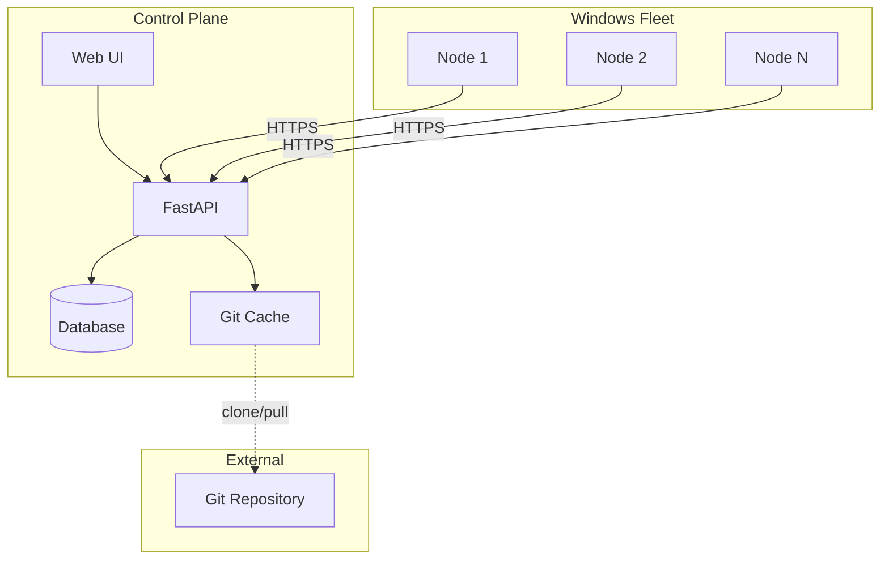
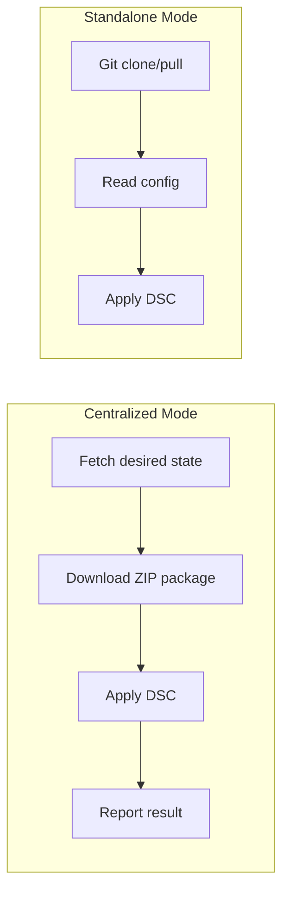
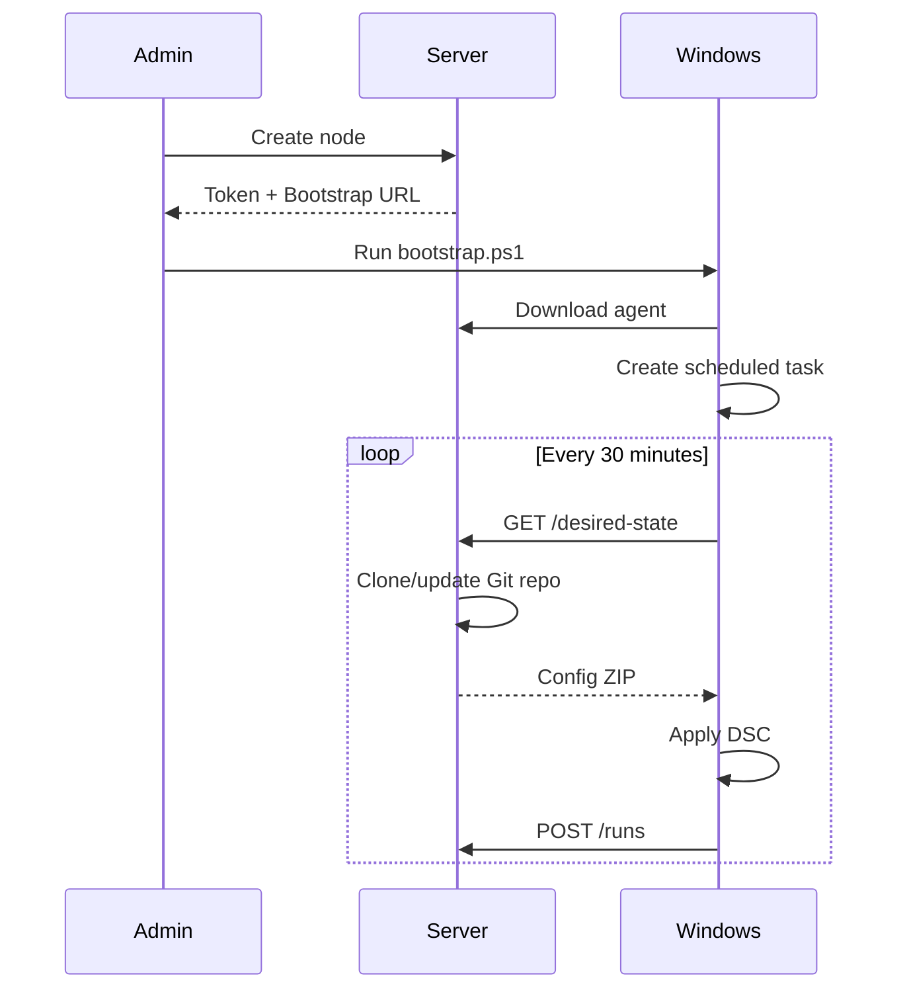

<p align="center">
  <h1 align="center">OpenTune</h1>
  <p align="center">
    <strong>GitOps Configuration Management for Windows DSC</strong>
  </p>
  <p align="center">
    <a href="#features">Features</a> •
    <a href="#quick-start">Quick Start</a> •
    <a href="#documentation">Documentation</a> •
    <a href="#architecture">Architecture</a>
  </p>
</p>

---

OpenTune is a lightweight, self-hosted control plane that brings GitOps principles to Windows configuration management using PowerShell Desired State Configuration (DSC).

## Why OpenTune?

- **Git as Source of Truth** — All configurations stored in version-controlled repositories
- **Pull-Based Model** — Agents fetch their desired state; no inbound connections required
- **Self-Healing** — Automatic drift detection and remediation every 30 minutes
- **Gitless Clients** — Windows nodes don't need Git installed (server-side cloning)
- **Dual-Mode Agent** — Works with or without the control plane
- **Zero Cloud Dependencies** — Fully self-hosted, runs anywhere

---

## Features

### Control Plane
- 🖥️ Modern React web interface
- 📊 Real-time dashboard with fleet status
- 🔄 Server-side Git cloning and ZIP packaging
- 📦 One-click bootstrap script generation
- 🔐 Secure token-based authentication

### Agent
- ⚡ Centralized mode with full server integration
- 🔌 Standalone mode for air-gapped environments
- 📝 Modular PowerShell architecture
- 🔁 Automatic scheduling via Windows Task Scheduler
- 📋 Detailed logging with rotation

---

## Quick Start

### Docker (Recommended)

```bash
# Clone the repository
git clone https://github.com/YOUR_USERNAME/opentune.git
cd opentune

# Generate a secure API key
export ADMIN_API_KEY=$(openssl rand -base64 32)
echo "Your API Key: $ADMIN_API_KEY"

# Start the server
docker compose up -d

# Open http://localhost:8000
```

### Developer Setup

```bash
# Backend
cd backend
python3 -m venv venv && source venv/bin/activate
pip install -r requirements.txt
cp .env.example .env  # Edit ADMIN_API_KEY
uvicorn app.main:app --reload

# Frontend (separate terminal)
cd frontend
npm install
npm run dev
```

---

## Architecture

OpenTune follows a hub-and-spoke architecture where the control plane manages configuration distribution to Windows nodes.



### Dual-Mode Agent

The agent supports two operational modes:



| Mode | Server Required | Git on Client | Use Case |
|------|-----------------|---------------|----------|
| Centralized | Yes | No | Managed fleet with monitoring |
| Standalone | No | Yes | Air-gapped or CI/CD environments |

### Bootstrap Workflow



---

## Documentation

| Document | Description |
|----------|-------------|
| [Architecture](docs/ARCHITECTURE.md) | System design and data flows |
| [API Reference](docs/API.md) | Complete REST API documentation |
| [Agent Guide](docs/AGENT.md) | Agent installation and configuration |
| [Docker Deployment](docs/DOCKER.md) | Container-based deployment |
| [Manual Deployment](docs/DEPLOY.md) | VM-based deployment guide |

---

## Usage

### 1. Add a Repository

Connect your Git repository containing DSC configurations:

```
Repositories → Add Repository
├── Name: security-baseline
├── URL: https://github.com/org/dsc-configs.git
└── Branch: main
```

### 2. Create a Policy

Define which configuration file to apply:

```
Policies → Add Policy
├── Name: workstation-security
├── Repository: security-baseline
└── Config Path: nodes/workstation.ps1
```

### 3. Register a Node

Create a node and get the bootstrap script:

```
Nodes → Add Node → Download Bootstrap Script
```

### 4. Deploy the Agent

Run the bootstrap script on your Windows machine:

```powershell
Set-ExecutionPolicy Bypass -Scope Process -Force
.\bootstrap-workstation-01.ps1
```

### 5. Assign Policy

Link the policy to your node:

```
Nodes → workstation-01 → Assign Policy → workstation-security
```

The agent will automatically apply the configuration on its next run (or immediately if just bootstrapped).

---

## Configuration Examples

### DSC Repository Structure

```
dsc-configs/
├── baselines/
│   ├── common.ps1          # Shared settings
│   └── security.ps1        # Security hardening
├── nodes/
│   ├── workstation.ps1     # Workstation config
│   └── server.ps1          # Server config
└── README.md
```

### Sample Configuration

```powershell
# nodes/workstation.ps1
Configuration Workstation {
    Import-DscResource -ModuleName PSDesiredStateConfiguration

    Node 'localhost' {
        # Windows Update service
        Service WindowsUpdate {
            Name        = 'wuauserv'
            StartupType = 'Automatic'
            State       = 'Running'
        }

        # Disable SMBv1
        WindowsOptionalFeature SMBv1 {
            Name   = 'SMB1Protocol'
            Ensure = 'Disable'
        }
    }
}

Workstation -OutputPath "$PSScriptRoot\..\mof"
```

### Agent Configuration (Centralized)

```json
{
    "mode": "centralized",
    "server_url": "https://opentune.company.com",
    "node_id": 1,
    "node_token": "your-secure-token",
    "use_git": false
}
```

### Agent Configuration (Standalone)

```json
{
    "mode": "standalone",
    "repo_url": "https://github.com/org/dsc-configs.git",
    "branch": "main",
    "config_path": "nodes/workstation.ps1"
}
```

---

## API Overview

### Admin Endpoints

| Method | Endpoint | Description |
|--------|----------|-------------|
| `GET` | `/api/v1/nodes/` | List all nodes |
| `POST` | `/api/v1/nodes/` | Create node |
| `POST` | `/api/v1/nodes/{id}/bootstrap` | Get bootstrap info |
| `GET` | `/api/v1/policies/` | List policies |
| `POST` | `/api/v1/policies/` | Create policy |
| `GET` | `/api/v1/runs/stats` | Fleet statistics |

### Agent Endpoints

| Method | Endpoint | Description |
|--------|----------|-------------|
| `GET` | `/api/v1/agents/nodes/{id}/desired-state` | Get configuration |
| `GET` | `/api/v1/agents/nodes/{id}/package` | Download config ZIP |
| `POST` | `/api/v1/agents/nodes/{id}/runs` | Report run result |

Full API documentation: [docs/API.md](docs/API.md)

---

## Security

- **Admin Authentication**: API key in `X-Admin-API-Key` header
- **Agent Authentication**: Node token in `X-Node-Token` header
- **Token Storage**: bcrypt hashed in database
- **Token Visibility**: Shown only once at creation
- **HTTPS**: Strongly recommended for production

### Best Practices

1. Generate strong API keys: `openssl rand -base64 32`
2. Use HTTPS with valid certificates
3. Rotate node tokens periodically
4. Use private Git repositories for sensitive configs
5. Restrict network access to the control plane

---

## Roadmap

- [x] FastAPI backend with SQLAlchemy
- [x] React web interface
- [x] Docker deployment
- [x] Server-side Git cloning
- [x] Automated bootstrap scripts
- [x] Dual-mode agent
- [x] Modular agent architecture
- [ ] Webhook notifications
- [ ] Node groups and tags
- [ ] Role-based access control
- [ ] Audit logging
- [ ] Agent auto-update
- [ ] Dark mode

---

## Contributing

Contributions are welcome! Please read the documentation first and feel free to submit pull requests.

### Development Setup

```bash
# Clone
git clone https://github.com/YOUR_USERNAME/opentune.git
cd opentune

# Backend
cd backend
python3 -m venv venv && source venv/bin/activate
pip install -r requirements.txt
uvicorn app.main:app --reload

# Frontend
cd ../frontend
npm install
npm run dev
```

---

## License

MIT License - see [LICENSE](LICENSE) for details.

---

<p align="center">
  Made with ❤️ for Windows administrators who deserve better tools.
</p>
