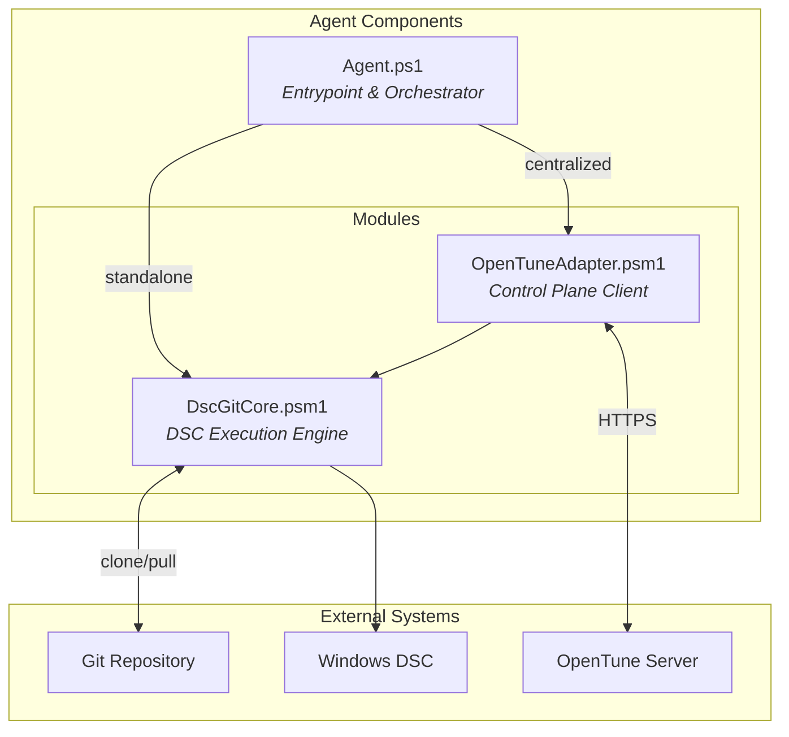
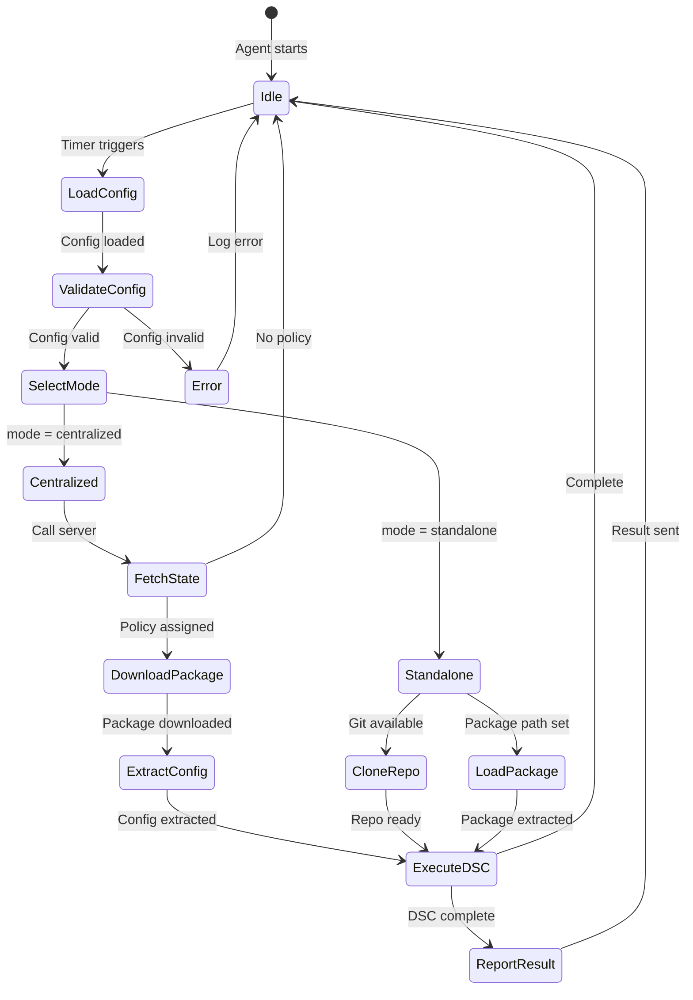
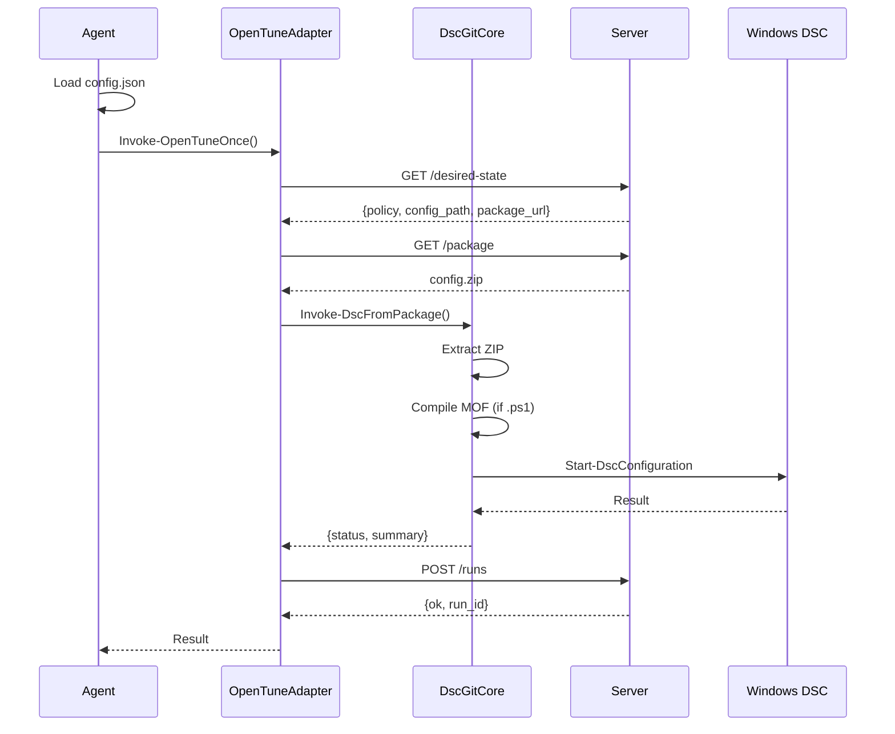
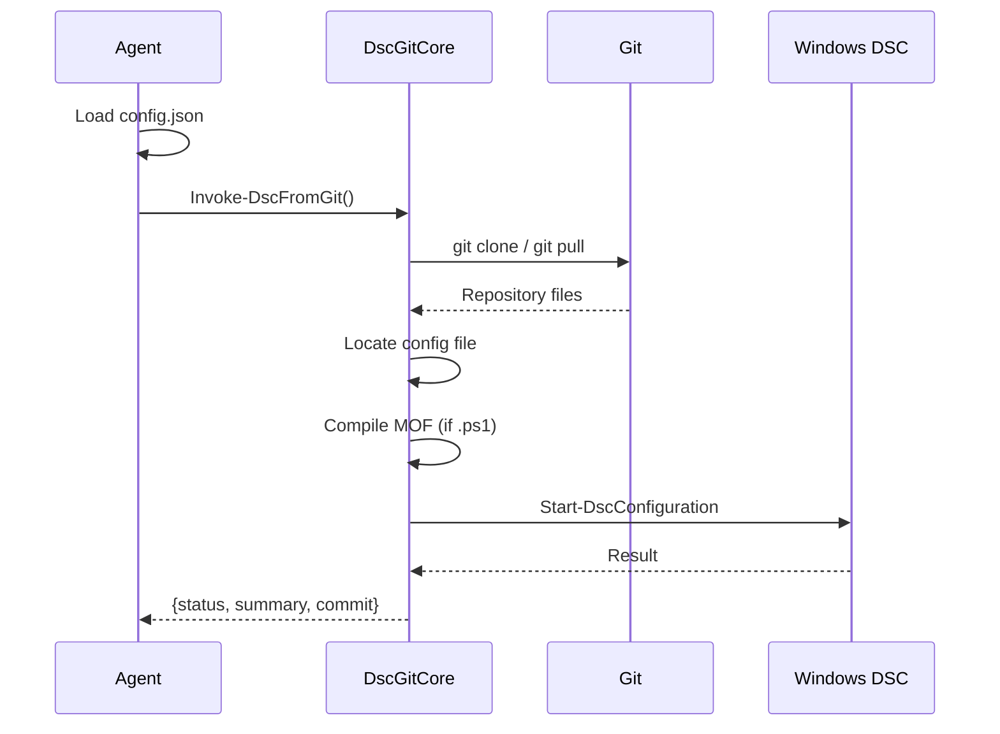

# OpenTune Agent Guide

Complete documentation for the OpenTune DSC Agent.

## Table of Contents

- [Overview](#overview)
- [Architecture](#architecture)
- [Installation](#installation)
- [Configuration](#configuration)
- [Agent Lifecycle](#agent-lifecycle)
- [Module Reference](#module-reference)
- [Execution Flow](#execution-flow)
- [Logging](#logging)
- [Troubleshooting](#troubleshooting)
- [Security](#security)

---

## Overview

The OpenTune Agent is a PowerShell-based client that applies DSC configurations to Windows systems. It supports two operational modes:

| Mode | Description | Server Required | Git on Client |
|------|-------------|-----------------|---------------|
| **Centralized** | Full integration with OpenTune control plane | Yes | No |
| **Standalone** | Direct Git-to-DSC without server | No | Yes |

---

## Architecture

The agent consists of three components with clear separation of responsibilities:



### Component Responsibilities

| Component | Responsibility |
|-----------|----------------|
| `Agent.ps1` | Load config, select mode, invoke appropriate module, handle logging |
| `DscGitCore.psm1` | Git operations, ZIP extraction, DSC compilation and execution |
| `OpenTuneAdapter.psm1` | Server communication, package download, result reporting |

---

## Installation

### Method 1: Automated Bootstrap (Recommended)

1. Create a node in the OpenTune web UI
2. Click **"Download Bootstrap Script"**
3. Copy the `.ps1` file to your Windows machine
4. Run as Administrator:

```powershell
Set-ExecutionPolicy Bypass -Scope Process -Force
.\bootstrap-nodename.ps1
```

The bootstrap script will:
- Create `C:\dsc-agent\` directory structure
- Download `Agent.ps1` and modules from server
- Write `config.json` with embedded credentials
- Set restrictive file permissions
- Create Windows Scheduled Task
- Run initial reconciliation

### Method 2: Manual Installation

```powershell
# Create directory structure
$agentDir = "C:\dsc-agent"
New-Item -Path "$agentDir\modules" -ItemType Directory -Force
New-Item -Path "$agentDir\work" -ItemType Directory -Force
New-Item -Path "$agentDir\logs" -ItemType Directory -Force

# Download components from OpenTune server
$serverUrl = "http://your-opentune-server:8000"
Invoke-WebRequest "$serverUrl/static/agent/Agent.ps1" -OutFile "$agentDir\Agent.ps1"
Invoke-WebRequest "$serverUrl/static/agent/modules/DscGitCore.psm1" -OutFile "$agentDir\modules\DscGitCore.psm1"
Invoke-WebRequest "$serverUrl/static/agent/modules/OpenTuneAdapter.psm1" -OutFile "$agentDir\modules\OpenTuneAdapter.psm1"

# Create configuration
$config = @{
    mode       = "centralized"
    server_url = "http://your-opentune-server:8000"
    node_id    = 1  # From web UI
    node_token = "your-token-here"  # From web UI
    use_git    = $false
}
$config | ConvertTo-Json | Set-Content "$agentDir\config.json"

# Create scheduled task
$action = New-ScheduledTaskAction -Execute "powershell.exe" `
    -Argument "-NoProfile -ExecutionPolicy Bypass -File $agentDir\Agent.ps1"
$trigger = New-ScheduledTaskTrigger -Once -At (Get-Date) `
    -RepetitionInterval (New-TimeSpan -Minutes 30) `
    -RepetitionDuration (New-TimeSpan -Days 9999)
$principal = New-ScheduledTaskPrincipal -UserId "SYSTEM" -LogonType ServiceAccount -RunLevel Highest
$settings = New-ScheduledTaskSettingsSet -AllowStartIfOnBatteries -DontStopIfGoingOnBatteries -StartWhenAvailable

Register-ScheduledTask -TaskName "OpenTune DSC Agent" `
    -Action $action -Trigger $trigger -Principal $principal -Settings $settings
```

---

## Configuration

Configuration is stored in `C:\dsc-agent\config.json`.

### Centralized Mode

```json
{
    "mode": "centralized",
    "server_url": "http://opentune.local:8000",
    "node_id": 1,
    "node_token": "abc123def456...",
    "use_git": false
}
```

| Field | Type | Required | Description |
|-------|------|----------|-------------|
| `mode` | string | Yes | Must be `"centralized"` |
| `server_url` | string | Yes | OpenTune server URL |
| `node_id` | int | Yes | Node ID from server |
| `node_token` | string | Yes | Authentication token |
| `use_git` | bool | No | If `true`, clone Git directly (default: `false`) |

### Standalone Mode (Git)

```json
{
    "mode": "standalone",
    "repo_url": "https://github.com/org/dsc-configs.git",
    "branch": "main",
    "config_path": "nodes/workstation.ps1"
}
```

| Field | Type | Required | Description |
|-------|------|----------|-------------|
| `mode` | string | Yes | Must be `"standalone"` |
| `repo_url` | string | Yes | Git repository URL |
| `branch` | string | No | Branch name (default: `main`) |
| `config_path` | string | Yes | Path to DSC config within repo |

### Standalone Mode (Local Package)

```json
{
    "mode": "standalone",
    "package_path": "C:\\configs\\my-config.zip",
    "config_path": "nodes/workstation.ps1"
}
```

---

## Agent Lifecycle

### State Machine



### Lifecycle Phases

1. **Initialization**
   - Load configuration from `config.json`
   - Import PowerShell modules
   - Initialize logging

2. **Mode Selection**
   - Determine centralized vs standalone
   - Validate required fields

3. **Configuration Retrieval**
   - Centralized: Fetch from server, download ZIP
   - Standalone: Clone Git or extract local package

4. **DSC Execution**
   - Compile `.ps1` to MOF (if needed)
   - Test current state
   - Apply configuration
   - Verify result

5. **Reporting** (Centralized only)
   - Send run result to server
   - Update node status

6. **Idle**
   - Wait for next scheduled run (30 minutes)

---

## Module Reference

### Agent.ps1

Main entrypoint script.

**Parameters:**

| Parameter | Type | Default | Description |
|-----------|------|---------|-------------|
| `-ConfigPath` | string | `C:\dsc-agent\config.json` | Path to configuration |
| `-WorkDir` | string | `C:\dsc-agent\work` | Working directory |
| `-LogDir` | string | `C:\dsc-agent\logs` | Log directory |
| `-Force` | switch | `$false` | Force apply even if compliant |

**Example:**

```powershell
# Normal run
& C:\dsc-agent\Agent.ps1

# Force apply
& C:\dsc-agent\Agent.ps1 -Force

# Custom paths
& C:\dsc-agent\Agent.ps1 -ConfigPath D:\config.json -WorkDir D:\work
```

---

### DscGitCore.psm1

DSC execution engine with no server dependencies.

#### Invoke-DscFromGit

Execute DSC from a Git repository.

```powershell
$result = Invoke-DscFromGit -RepoUrl "https://github.com/org/repo.git" `
                            -Branch "main" `
                            -ConfigPath "nodes/pc.ps1" `
                            -WorkDir "C:\dsc-agent\work" `
                            -Force
```

**Parameters:**

| Parameter | Type | Required | Description |
|-----------|------|----------|-------------|
| `-RepoUrl` | string | Yes | Git repository URL |
| `-Branch` | string | No | Branch (default: `main`) |
| `-ConfigPath` | string | Yes | Config path within repo |
| `-WorkDir` | string | No | Working directory |
| `-Force` | switch | No | Force apply |

**Returns:**

```powershell
@{
    status  = "success"  # or "failed"
    summary = "Configuration applied successfully in 45s"
    commit  = "abc123def456..."
}
```

#### Invoke-DscFromPackage

Execute DSC from a ZIP package.

```powershell
$result = Invoke-DscFromPackage -PackagePath "C:\packages\config.zip" `
                                 -ConfigPath "nodes/pc.ps1" `
                                 -WorkDir "C:\dsc-agent\work"
```

#### Invoke-DscFromPath

Execute DSC from a local path.

```powershell
$result = Invoke-DscFromPath -ConfigPath "C:\configs\myconfig.ps1" -Force
```

#### Utility Functions

```powershell
# Logging
Write-DscLog -Message "Test message" -Level INFO  # INFO, WARN, ERROR, DEBUG

# Check Git availability
$hasGit = Test-GitAvailable

# Git operations
$info = Invoke-GitCloneOrPull -RepoUrl $url -Branch "main" -DestinationPath "C:\repo"

# ZIP extraction
$commit = Expand-ConfigPackage -ZipPath "C:\pkg.zip" -DestinationPath "C:\config"

# Ensure directory exists
Ensure-Directory -Path "C:\some\path"
```

---

### OpenTuneAdapter.psm1

Control plane integration module.

#### Invoke-OpenTuneOnce

Execute a complete reconciliation cycle.

```powershell
$result = Invoke-OpenTuneOnce -ServerUrl "http://server:8000" `
                               -NodeId 1 `
                               -NodeToken "abc123" `
                               -WorkDir "C:\dsc-agent\work" `
                               -UseGit:$false `
                               -Force `
                               -MaxRetries 3
```

**Parameters:**

| Parameter | Type | Required | Description |
|-----------|------|----------|-------------|
| `-ServerUrl` | string | Yes | OpenTune server URL |
| `-NodeId` | int | Yes | Node ID |
| `-NodeToken` | string | Yes | Authentication token |
| `-WorkDir` | string | No | Working directory |
| `-UseGit` | switch | No | Clone Git directly instead of ZIP |
| `-Force` | switch | No | Force apply |
| `-MaxRetries` | int | No | API retry attempts (default: 3) |

#### API Functions

```powershell
# Get desired state
$state = Get-OpenTuneDesiredState -ServerUrl $url -NodeId $id -NodeToken $token

# Download package
Get-OpenTunePackage -PackageUrl $url -NodeToken $token -OutputPath "C:\pkg.zip"

# Report run
Send-OpenTuneRunReport -ServerUrl $url -NodeId $id -NodeToken $token -ReportData @{
    policy_id  = 1
    git_commit = "abc123"
    status     = "success"
    summary    = "Applied OK"
}

# Heartbeat
Send-OpenTuneHeartbeat -ServerUrl $url -NodeId $id -NodeToken $token
```

---

## Execution Flow

### Centralized Mode Flow



### Standalone Mode Flow



---

## Logging

Logs are stored in `C:\dsc-agent\logs\` with daily rotation.

### Log Location

```
C:\dsc-agent\logs\
├── opentune-agent-2024-01-15.log
├── opentune-agent-2024-01-16.log
└── opentune-agent-2024-01-17.log
```

### Log Format

```
[2024-01-15 10:30:00] [INFO] OpenTune Agent v1.0.0 starting
[2024-01-15 10:30:01] [INFO] Mode: centralized
[2024-01-15 10:30:02] [INFO] Server: http://server:8000
[2024-01-15 10:30:03] [INFO] Fetching desired state...
[2024-01-15 10:30:05] [INFO] Policy: workstation-security (ID: 1)
[2024-01-15 10:30:10] [INFO] Downloading package...
[2024-01-15 10:30:15] [INFO] Extracting to: C:\dsc-agent\work\config
[2024-01-15 10:30:20] [INFO] Applying DSC configuration...
[2024-01-15 10:31:05] [INFO] DSC applied in 45 seconds
[2024-01-15 10:31:06] [INFO] Result: success
[2024-01-15 10:31:07] [INFO] Run reported. ID: 42
```

### Log Levels

| Level | Description |
|-------|-------------|
| `INFO` | Normal operations |
| `WARN` | Non-critical issues |
| `ERROR` | Failures |
| `DEBUG` | Detailed debugging |

### Log Rotation

Logs older than 7 days are automatically deleted at agent startup.

---

## Troubleshooting

### Check Agent Status

```powershell
# View scheduled task
Get-ScheduledTask -TaskName "OpenTune DSC Agent"
Get-ScheduledTaskInfo -TaskName "OpenTune DSC Agent"

# Run manually
Start-ScheduledTask -TaskName "OpenTune DSC Agent"

# View recent logs
Get-Content C:\dsc-agent\logs\opentune-agent-$(Get-Date -Format 'yyyy-MM-dd').log -Tail 50
```

### Common Issues

#### Task Not Running

```powershell
# Check task status
Get-ScheduledTask -TaskName "OpenTune DSC Agent" | Select-Object State

# Check last run result
Get-ScheduledTaskInfo -TaskName "OpenTune DSC Agent" | Select-Object LastRunTime, LastTaskResult
```

#### Cannot Connect to Server

```powershell
# Test connectivity
$config = Get-Content C:\dsc-agent\config.json | ConvertFrom-Json
Invoke-RestMethod "$($config.server_url)/health"

# Test with token
$headers = @{ "X-Node-Token" = $config.node_token }
Invoke-RestMethod "$($config.server_url)/api/v1/agents/nodes/$($config.node_id)/desired-state" -Headers $headers
```

#### DSC Configuration Fails

```powershell
# Check DSC status
Get-DscConfigurationStatus
Get-DscConfigurationStatus -All

# Test configuration
Test-DscConfiguration -Detailed

# View DSC logs
Get-WinEvent -LogName "Microsoft-Windows-Dsc/Operational" -MaxEvents 20
```

#### Reset DSC State

```powershell
# Clear pending configurations
Remove-DscConfigurationDocument -Stage Current, Pending, Previous -Force

# Stop DSC processes
Stop-DscConfiguration -Force
```

### Debug Mode

Run the agent interactively with verbose output:

```powershell
& C:\dsc-agent\Agent.ps1 -Verbose
```

---

## Security

### File Permissions

The bootstrap script configures restrictive ACLs:

```
C:\dsc-agent\config.json
├── Administrators: Full Control
├── SYSTEM: Full Control
└── (No other access)
```

### Token Security

- Tokens are shown **only once** at node creation
- Tokens are hashed (bcrypt) in the server database
- Old tokens are invalidated on regeneration
- Use HTTPS to protect tokens in transit

### Recommendations

1. **Use HTTPS** for server communication
2. **Rotate tokens** periodically
3. **Monitor logs** for authentication failures
4. **Restrict network access** to control plane
5. **Use private Git repos** for sensitive configs

### Regenerating Tokens

If a token is compromised:

1. Go to **Nodes → [Node] → Get Bootstrap** in web UI
2. This regenerates the token (old one stops working)
3. Re-run bootstrap or manually update `config.json`

---

## Updating the Agent

### From Server

```powershell
$serverUrl = "http://your-opentune-server:8000"
$agentDir = "C:\dsc-agent"

# Download new files
Invoke-WebRequest "$serverUrl/static/agent/Agent.ps1" -OutFile "$agentDir\Agent.ps1"
Invoke-WebRequest "$serverUrl/static/agent/modules/DscGitCore.psm1" -OutFile "$agentDir\modules\DscGitCore.psm1"
Invoke-WebRequest "$serverUrl/static/agent/modules/OpenTuneAdapter.psm1" -OutFile "$agentDir\modules\OpenTuneAdapter.psm1"

# config.json is preserved (contains credentials)
```

### Via Bootstrap

Re-downloading and running the bootstrap script will update all components while preserving node identity (same node ID and token).

---

## Uninstalling

```powershell
# Remove scheduled task
Unregister-ScheduledTask -TaskName "OpenTune DSC Agent" -Confirm:$false

# Remove agent files
Remove-Item -Path C:\dsc-agent -Recurse -Force

# Optionally clear DSC state
Remove-DscConfigurationDocument -Stage Current, Pending, Previous -Force
```
