# OpenTune Architecture

This document describes the architecture of OpenTune, a GitOps-based configuration management platform for Windows DSC.

## Table of Contents

- [System Overview](#system-overview)
- [Components](#components)
- [Dual-Mode Agent Architecture](#dual-mode-agent-architecture)
- [Server-Side Cloning](#server-side-cloning)
- [Node Lifecycle](#node-lifecycle)
- [Data Flow](#data-flow)
- [Security Model](#security-model)
- [Directory Structure](#directory-structure)

---

## System Overview

OpenTune is a pull-based configuration management system that brings GitOps principles to Windows environments. It consists of three main components:

1. **Control Plane** - FastAPI backend + React frontend
2. **Agent** - PowerShell client running on Windows nodes
3. **Git Repository** - Source of truth for DSC configurations

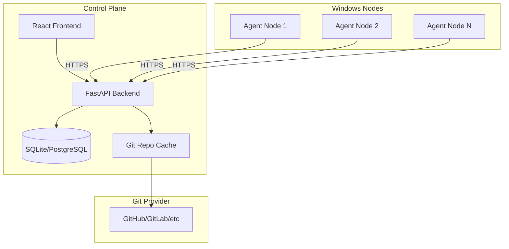

---

## Components

### Backend (FastAPI)

The backend is built with FastAPI and provides:

- REST API for admin operations
- REST API for agent communication
- Static file serving (agent scripts)
- Server-side Git operations
- ZIP package generation

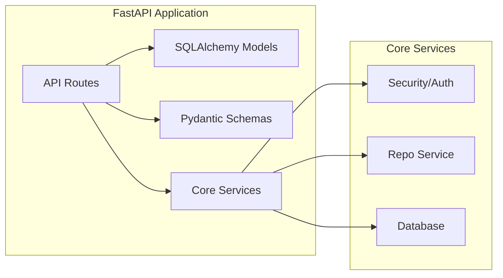

**Key Modules:**

| Module | Purpose |
|--------|---------|
| `app/api/routes/nodes.py` | Node CRUD, policy assignment |
| `app/api/routes/agents.py` | Agent endpoints, bootstrap, packages |
| `app/api/routes/policies.py` | Policy management |
| `app/api/routes/git_repos.py` | Repository management |
| `app/core/repo_service.py` | Git clone/pull, ZIP packaging |
| `app/core/security.py` | Token hashing, authentication |

### Frontend (React)

Single-page application built with:

- React 18
- React Router
- Tailwind CSS
- Lucide icons

**Pages:**

| Page | Purpose |
|------|---------|
| Dashboard | Fleet overview, statistics |
| Nodes | Node management, bootstrap download |
| Policies | Policy CRUD |
| Repositories | Git repository management |
| Node Detail | Node info, run history |

### Agent (PowerShell)

Modular PowerShell agent with three components:

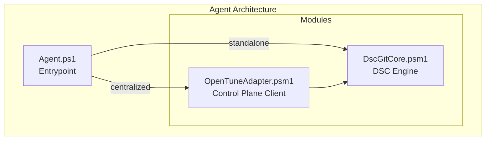

---

## Dual-Mode Agent Architecture

The agent supports two operational modes:

### Centralized Mode

Full integration with OpenTune control plane.

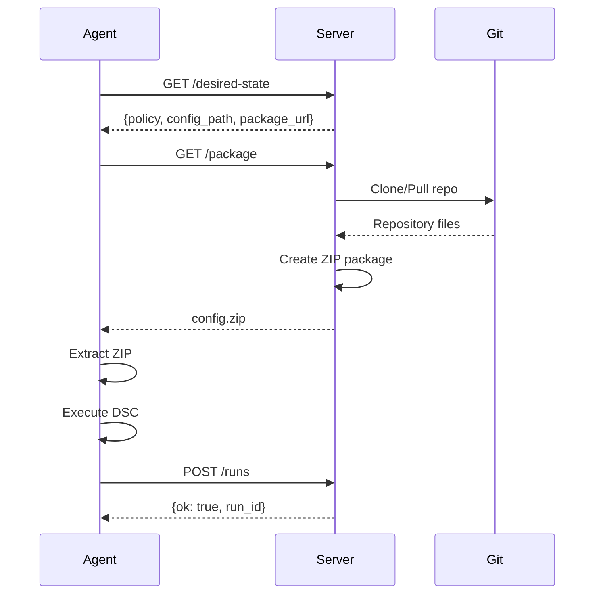

**Characteristics:**
- No Git required on Windows nodes
- Server handles all Git operations
- Results reported to control plane
- Centralized monitoring and compliance

### Standalone Mode

Direct Git-to-DSC without server.

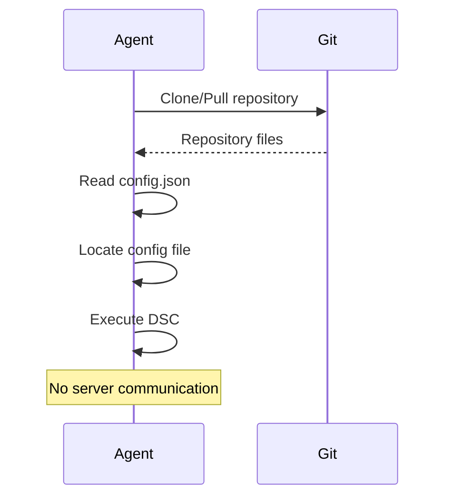

**Characteristics:**
- Requires Git on Windows node
- No external dependencies at runtime
- Ideal for air-gapped environments
- No central monitoring

### Mode Selection

The mode is determined by `config.json`:

```json
// Centralized
{
  "mode": "centralized",
  "server_url": "http://server:8000",
  "node_id": 1,
  "node_token": "xxx"
}

// Standalone
{
  "mode": "standalone",
  "repo_url": "https://github.com/org/repo.git",
  "config_path": "nodes/pc.ps1"
}
```

---

## Server-Side Cloning

OpenTune clones Git repositories on the server, eliminating the need for Git on Windows clients.

### Repository Cache Structure

```
/app/data/repos/
├── 1/                          # Repository ID
│   ├── .git/
│   ├── baselines/
│   │   ├── common.ps1
│   │   └── security.ps1
│   └── nodes/
│       └── workstation.ps1
└── 2/                          # Another repository
    └── ...
```

### Clone/Update Flow

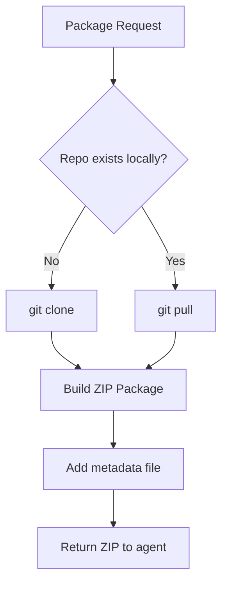

### Package Contents

The ZIP package contains:

```
config-{policy_id}.zip
├── _opentune_meta.txt          # Commit hash, timestamp
├── {config_file}.ps1           # Main configuration
└── baselines/                  # Supporting files (if referenced)
    ├── common.ps1
    └── security.ps1
```

### Caching Strategy

| Scenario | Action |
|----------|--------|
| First request | Clone repository |
| Subsequent requests | Pull latest changes |
| Repository deleted | Remove from cache |
| Branch changed | Checkout new branch |

**Future improvements:**
- TTL-based cache invalidation
- Webhook-triggered updates
- Pre-warming cache on commit

---

## Node Lifecycle

A node goes through several states during its lifecycle:

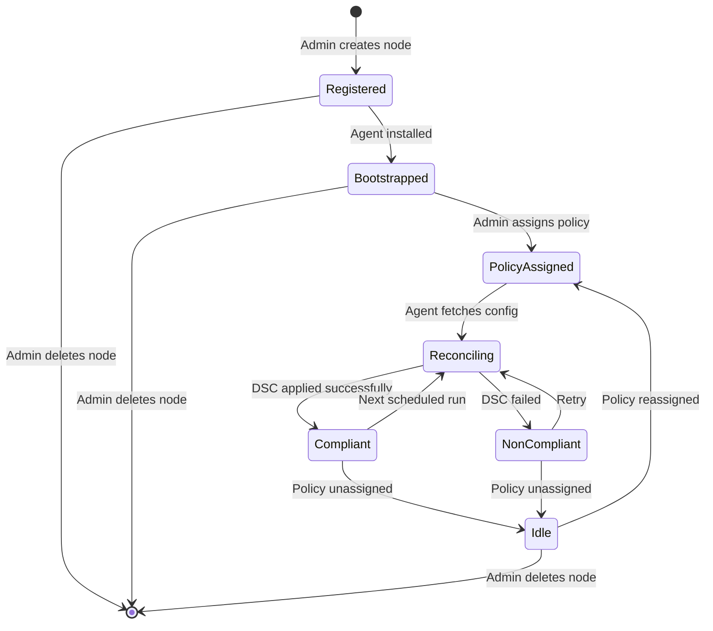

### State Descriptions

| State | Description |
|-------|-------------|
| **Registered** | Node created, token generated, no agent installed |
| **Bootstrapped** | Agent installed and checking in |
| **PolicyAssigned** | Policy linked to node |
| **Reconciling** | Agent applying configuration |
| **Compliant** | Last run successful |
| **NonCompliant** | Last run failed |
| **Idle** | No policy assigned |

### Typical Workflow

1. **Registration**
   - Admin creates node in UI
   - System generates unique token
   - Token shown once (store securely!)

2. **Bootstrap**
   - Admin downloads bootstrap script
   - Script run on Windows machine
   - Agent installed, scheduled task created

3. **Policy Assignment**
   - Admin assigns policy to node
   - Next agent run picks up configuration

4. **Reconciliation Loop**
   - Agent runs every 30 minutes
   - Fetches desired state
   - Downloads configuration package
   - Applies DSC configuration
   - Reports result

---

## Data Flow

### Admin Operations

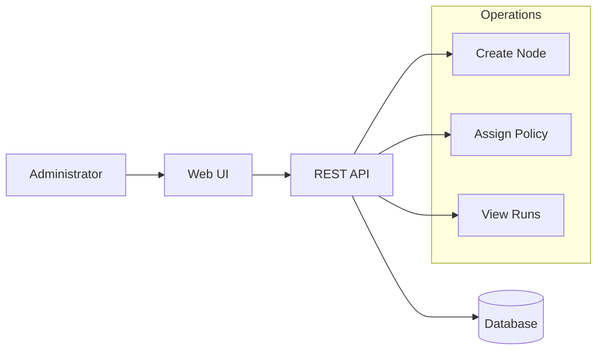

### Agent Operations

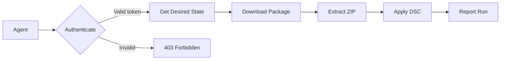

### Complete System Flow

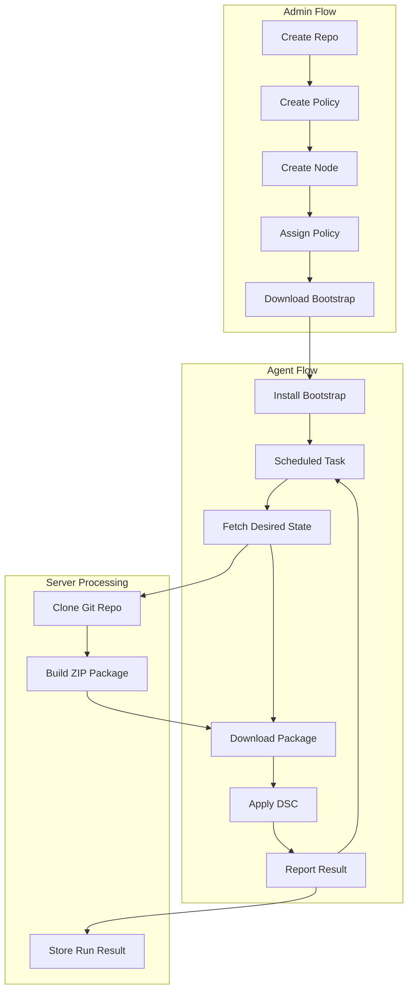

---

## Security Model

### Authentication Layers

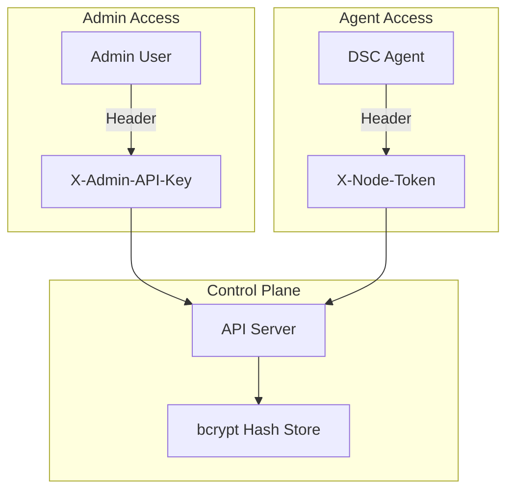

### Token Security

| Aspect | Implementation |
|--------|----------------|
| Storage | bcrypt hash (60 rounds) |
| Transmission | Header-based (HTTPS recommended) |
| Visibility | Shown once at creation |
| Rotation | Manual regeneration via API |

### File Permissions (Windows)

Bootstrap script sets restrictive ACLs on `config.json`:

```
Administrators: Full Control
SYSTEM: Full Control
(All other access removed)
```

### Recommendations

1. **Always use HTTPS** in production
2. **Rotate tokens** periodically
3. **Use private Git repos** for sensitive configs
4. **Limit network access** to control plane
5. **Monitor authentication failures**

---

## Directory Structure

### Server

```
/app/
├── app/                        # FastAPI application
│   ├── api/
│   │   ├── routes/
│   │   │   ├── agents.py      # Agent endpoints
│   │   │   ├── nodes.py       # Node management
│   │   │   ├── policies.py    # Policy management
│   │   │   └── git_repos.py   # Repository management
│   │   └── __init__.py
│   ├── core/
│   │   ├── config.py          # Settings
│   │   ├── db.py              # Database
│   │   ├── repo_service.py    # Git operations
│   │   └── security.py        # Authentication
│   ├── models/                # SQLAlchemy models
│   ├── schemas/               # Pydantic schemas
│   └── main.py                # Application entry
├── static/
│   └── agent/                 # Agent files
│       ├── Agent.ps1
│       └── modules/
├── frontend/
│   └── dist/                  # Built React app
└── data/
    ├── opentune.db            # SQLite database
    └── repos/                 # Cloned repositories
        ├── 1/
        └── 2/
```

### Agent (Windows)

```
C:\dsc-agent\
├── Agent.ps1                  # Main script
├── config.json                # Configuration
├── modules/
│   ├── DscGitCore.psm1       # DSC engine
│   └── OpenTuneAdapter.psm1  # Server client
├── work/
│   ├── packages/             # Downloaded ZIPs
│   └── config/               # Extracted configs
└── logs/
    └── opentune-agent-*.log  # Daily logs
```

---

## Scalability Considerations

### Current Limitations

- SQLite suitable for ~100 nodes
- Single-process server
- No clustering support

### Scaling Options

| Scale | Recommendation |
|-------|----------------|
| < 100 nodes | SQLite, single instance |
| 100-1000 nodes | PostgreSQL, single instance |
| > 1000 nodes | PostgreSQL, load balancer, multiple instances |

### Future Improvements

- Redis for session/cache
- Celery for async Git operations
- Webhook support for instant updates
- Agent auto-update mechanism
- Multi-tenancy support
