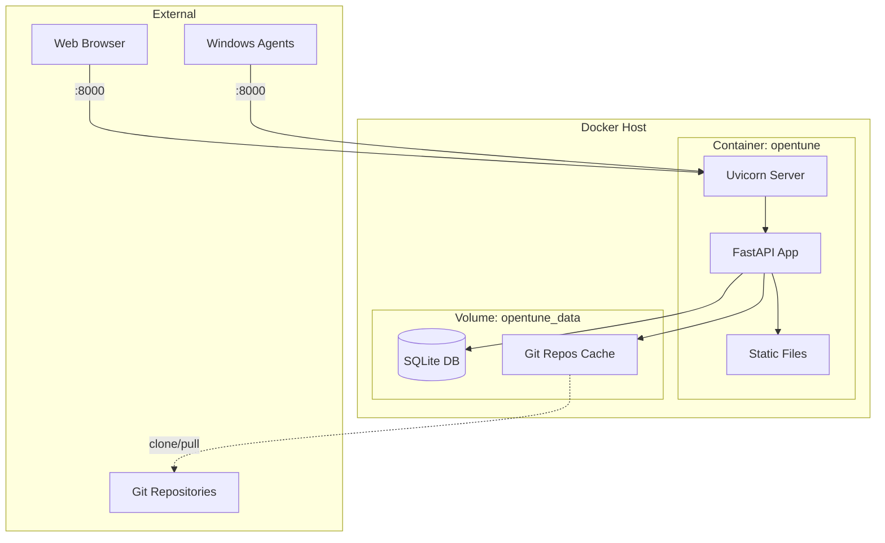

# OpenTune Docker Deployment Guide

Complete guide for deploying OpenTune using Docker.

## Table of Contents

- [Quick Start](#quick-start)
- [Configuration](#configuration)
- [Data Persistence](#data-persistence)
- [Production Setup](#production-setup)
- [HTTPS Configuration](#https-configuration)
- [Troubleshooting](#troubleshooting)
- [Maintenance](#maintenance)

---

## Quick Start

```bash
# Clone the repository
git clone https://github.com/YOUR_USERNAME/opentune.git
cd opentune

# Generate a secure API key
export ADMIN_API_KEY=$(openssl rand -base64 32)
echo "Your API Key: $ADMIN_API_KEY"

# Start the server
docker compose up -d

# Verify it's running
curl http://localhost:8000/health

# Open http://localhost:8000 in your browser
```

---

## Configuration

### Environment Variables

| Variable | Default | Required | Description |
|----------|---------|----------|-------------|
| `ADMIN_API_KEY` | - | **Yes** | API key for admin authentication |
| `DATABASE_URL` | `sqlite:///./data/opentune.db` | No | Database connection string |
| `SERVER_URL` | (auto-detect) | No | Public URL for bootstrap scripts |
| `REPOS_DIR` | `/app/data/repos` | No | Directory for cached Git repos |
| `PROJECT_NAME` | `opentune` | No | Project name (shown in UI) |
| `DEBUG` | `false` | No | Enable debug logging |

### Configuration Methods

#### Method 1: Environment Variables

```bash
ADMIN_API_KEY=your-secret-key docker compose up -d
```

#### Method 2: .env File

```bash
# Create .env file
cat > .env << EOF
ADMIN_API_KEY=your-secure-api-key-here
SERVER_URL=https://opentune.company.com
PROJECT_NAME=opentune
DEBUG=false
EOF

# Start (automatically reads .env)
docker compose up -d
```

### SERVER_URL Configuration

The `SERVER_URL` is embedded in bootstrap scripts. Configure it when:

- Running behind a reverse proxy
- Using a custom domain
- Accessing via hostname instead of IP

```bash
# .env
SERVER_URL=https://opentune.company.com
```

If not set, OpenTune attempts to auto-detect from the incoming request.

---

## Data Persistence

### Volume Structure

All persistent data is stored in the `opentune_data` Docker volume:

```
/app/data/
├── opentune.db           # SQLite database
└── repos/                # Cached Git repositories
    ├── 1/                # Repository ID 1
    │   ├── .git/
    │   ├── baselines/
    │   └── nodes/
    └── 2/                # Repository ID 2
        └── ...
```

### REPOS_DIR Structure

The server clones Git repositories into `REPOS_DIR`:

```
repos/
├── 1/                              # Repo ID = 1
│   ├── .git/                       # Git metadata
│   ├── baselines/
│   │   ├── common.ps1
│   │   └── security.ps1
│   └── nodes/
│       └── workstation.ps1
└── 2/                              # Repo ID = 2
    └── ...
```

Each repository is cloned once and updated (`git pull`) on subsequent requests.

### Backup

```bash
# Backup database
docker compose exec opentune cat /app/data/opentune.db > backup-$(date +%Y%m%d).db

# Full volume backup
docker run --rm -v opentune_data:/data -v $(pwd):/backup alpine \
  tar czf /backup/opentune-backup-$(date +%Y%m%d).tar.gz /data
```

### Restore

```bash
# Stop container
docker compose down

# Restore database
docker run --rm -v opentune_data:/data -v $(pwd):/backup alpine \
  sh -c "rm -rf /data/* && tar xzf /backup/opentune-backup-20240115.tar.gz -C /"

# Start container
docker compose up -d
```

---

## Production Setup

### PostgreSQL Configuration

For production, use PostgreSQL instead of SQLite:

```yaml
# docker-compose.override.yml
version: '3.8'

services:
  opentune:
    environment:
      - DATABASE_URL=postgresql://opentune:secretpassword@db:5432/opentune
    depends_on:
      db:
        condition: service_healthy

  db:
    image: postgres:15-alpine
    environment:
      - POSTGRES_USER=opentune
      - POSTGRES_PASSWORD=secretpassword
      - POSTGRES_DB=opentune
    volumes:
      - postgres_data:/var/lib/postgresql/data
    healthcheck:
      test: ["CMD-SHELL", "pg_isready -U opentune"]
      interval: 5s
      timeout: 5s
      retries: 5

volumes:
  postgres_data:
```

```bash
# Start with PostgreSQL
docker compose up -d
```

### Resource Limits

```yaml
# docker-compose.override.yml
services:
  opentune:
    deploy:
      resources:
        limits:
          cpus: '2'
          memory: 1G
        reservations:
          cpus: '0.5'
          memory: 256M
```

### Health Checks

The container includes a built-in health check:

```bash
# Check health status
docker compose ps
docker inspect opentune --format='{{.State.Health.Status}}'

# Manual health check
curl -f http://localhost:8000/health
```

---

## HTTPS Configuration

### Option 1: Traefik Reverse Proxy

```yaml
# docker-compose.override.yml
services:
  opentune:
    labels:
      - "traefik.enable=true"
      - "traefik.http.routers.opentune.rule=Host(`opentune.company.com`)"
      - "traefik.http.routers.opentune.entrypoints=websecure"
      - "traefik.http.routers.opentune.tls.certresolver=letsencrypt"
    networks:
      - traefik
    ports: []  # Remove public port

networks:
  traefik:
    external: true
```

### Option 2: Nginx Reverse Proxy (External)

If you have Nginx running on the host:

```yaml
# docker-compose.override.yml
services:
  opentune:
    ports:
      - "127.0.0.1:8000:8000"  # Only localhost
```

```nginx
# /etc/nginx/sites-available/opentune
server {
    listen 80;
    server_name opentune.company.com;
    return 301 https://$server_name$request_uri;
}

server {
    listen 443 ssl http2;
    server_name opentune.company.com;

    ssl_certificate /etc/letsencrypt/live/opentune.company.com/fullchain.pem;
    ssl_certificate_key /etc/letsencrypt/live/opentune.company.com/privkey.pem;
    
    # Security headers
    add_header X-Frame-Options DENY;
    add_header X-Content-Type-Options nosniff;
    add_header X-XSS-Protection "1; mode=block";

    location / {
        proxy_pass http://127.0.0.1:8000;
        proxy_set_header Host $host;
        proxy_set_header X-Real-IP $remote_addr;
        proxy_set_header X-Forwarded-For $proxy_add_x_forwarded_for;
        proxy_set_header X-Forwarded-Proto $scheme;
        
        # WebSocket support (if needed in future)
        proxy_http_version 1.1;
        proxy_set_header Upgrade $http_upgrade;
        proxy_set_header Connection "upgrade";
    }
}
```

```bash
# Enable site and get certificate
sudo ln -s /etc/nginx/sites-available/opentune /etc/nginx/sites-enabled/
sudo certbot --nginx -d opentune.company.com
sudo systemctl reload nginx
```

### Option 3: Nginx in Docker

```yaml
# docker-compose.override.yml
services:
  nginx:
    image: nginx:alpine
    ports:
      - "80:80"
      - "443:443"
    volumes:
      - ./nginx.conf:/etc/nginx/nginx.conf:ro
      - ./certs:/etc/nginx/certs:ro
    depends_on:
      - opentune

  opentune:
    ports: []  # Remove public port
```

---

## Caching Strategy

### Current Implementation

- Repositories are cloned on first access
- Subsequent requests perform `git pull` to update
- ZIP packages are generated on-demand
- No TTL-based cache invalidation

### Cache Location

```
/app/data/repos/
├── 1/                    # Cloned repo (persistent)
├── 2/                    # Cloned repo (persistent)
└── ...
```

### Manual Cache Clear

```bash
# Clear all cached repos
docker compose exec opentune rm -rf /app/data/repos/*

# Clear specific repo
docker compose exec opentune rm -rf /app/data/repos/1
```

### Future Improvements

- Webhook-triggered cache invalidation
- TTL-based automatic refresh
- Pre-warming cache on repository add
- Background update jobs

---

## Security Notes

### Container Security

- Runs as non-root user (`appuser`)
- No privileged mode required
- Minimal base image (`python:3.11-slim`)

### Network Security

- Only port 8000 exposed by default
- Use HTTPS in production
- Consider firewall rules to restrict access

### Secrets Management

```bash
# Generate secure API key
openssl rand -base64 32

# Use Docker secrets (Swarm mode)
echo "your-api-key" | docker secret create opentune_api_key -
```

### Recommendations

1. **Always use HTTPS** in production
2. **Set strong API key** (32+ characters)
3. **Restrict network access** to trusted IPs
4. **Regular backups** of database and repos
5. **Monitor container logs** for anomalies

---

## Troubleshooting

### Container Won't Start

```bash
# Check logs
docker compose logs opentune

# Common issues:
# - Missing ADMIN_API_KEY
# - Port 8000 already in use
# - Permission issues on volume
```

### Database Locked (SQLite)

```bash
# Restart container
docker compose restart opentune

# If persists, check for multiple instances
docker ps -a | grep opentune
```

### Git Clone Fails

```bash
# Check git is available
docker compose exec opentune git --version

# Test clone manually
docker compose exec opentune git clone https://github.com/test/repo.git /tmp/test

# Check network access
docker compose exec opentune curl -I https://github.com
```

### Cannot Access Web UI

```bash
# Check container is running
docker compose ps

# Check port binding
docker compose port opentune 8000

# Check firewall
sudo ufw status
sudo iptables -L -n | grep 8000
```

### Reset Everything

```bash
# ⚠️ WARNING: Deletes all data!
docker compose down -v
docker compose up -d
```

---

## Maintenance

### View Logs

```bash
# Live logs
docker compose logs -f opentune

# Last 100 lines
docker compose logs --tail 100 opentune

# Since specific time
docker compose logs --since 1h opentune
```

### Update to New Version

```bash
# Pull latest code
git pull origin main

# Rebuild and restart
docker compose up -d --build
```

### Database Migrations

Currently, OpenTune auto-creates tables on startup. For schema changes:

```bash
# Backup first!
docker compose exec opentune cat /app/data/opentune.db > backup.db

# Restart to apply migrations
docker compose restart opentune
```

### Disk Usage

```bash
# Check volume size
docker system df -v | grep opentune

# Clean unused images
docker image prune -a
```

---

## Commands Reference

| Action | Command |
|--------|---------|
| Start | `docker compose up -d` |
| Stop | `docker compose down` |
| Restart | `docker compose restart` |
| Logs | `docker compose logs -f` |
| Shell access | `docker compose exec opentune /bin/bash` |
| Rebuild | `docker compose up -d --build` |
| Status | `docker compose ps` |
| Health check | `curl http://localhost:8000/health` |
| Reset (⚠️) | `docker compose down -v && docker compose up -d` |

---

## Architecture Diagram


